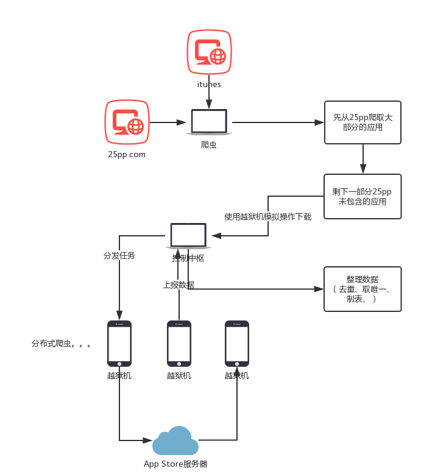

## iOS爬虫

`iOS`的应用爬虫，是一个很大的难点， 因为iOS对于隐私的限制，所以我们只能通过`URL Scheme`（私有方法肯定不予考虑）来判断应用是否安装， 而获取其他应用设定的`URL Scheme`就必须下载并解析相应的应用。 

整体来说，iOS上判断应用的安装情况，是困难且不够准确的 ：

1. 获取`URL Scheme`困难， 必须要下载`ipa`并解压分析，才能知道`URL Scheme`
2. 必须将要判断的`URL Scheme`以配置的形式打包进APP中供苹果审核， 也就决定了我们不能动态去更新。
3. `URL Scheme`不是唯一的，且是可变的。 所以一些应用会更新`URL Scheme`的配置， 一些应用会伪造`URL Scheme`的配置，一些应用没有`URL Scheme`的配置， 这都会影响判断的准确性。

所以，iOS应用判断是困难且不准确的。

而下载`ipa`也是比较困难的一件事，`AppStore`的请求都进行了加密，通过逆向工程来分析`AppStore`购买应用并下载应用的请求流程也较为复杂，难度较高。（水平有限，逆向能力不够，汇编代码不熟。 一般越狱平台都应该能逆向其请求逻辑，所以我们选择从越狱平台去下载应用）。

# iOS爬虫实现说明

当前iOS爬虫，采取`python`语言做预处理， 采用`flask`做一个控制中枢， 编写`tweak`使用越狱机做app爬虫节点。 总体来说，还算是一个分布式的爬虫系统。

整个爬虫流程分为4个步骤 ：

* 预处理， 先尝试在越狱平台 pp助手上爬取大部分的应用。
* 服务器， 控制中枢，向爬虫节点分发任务，以及汇总数据。
* tweak爬虫， 模拟操作，以自动下载APP，并上诉数据给服务器。
* 整理 ， 整理收集到的数据，进行去重检测。

### 预处理

预处理，是先尝试在越狱平台，如[pp助手](https://www.25pp.com)， 爬取大部分的数据。

越狱平台应该拥有技术能力去逆向 appstore,以批量下载应用。 但是我们没有这个技术能力， 只能从这些平台上爬数据。

这部分比较简单，主要在`pre-process.py` 这个文件中，先通过苹果的一些接口以获取APP的基本信息， 然后通过pp助手网站，尝试进行下载。 对于一些应用，pp助手上没有提供，所以会有接下来，我们自己的方式来爬取appstore.

在一部分的开发经验，就是不要使用`python`的相关接口去下载应用，因为应用是大文件，很容易下载失败，而直接使用`wget`等工具去下载，这些工具拥有自动重试的功能，会方便可靠很多。

### 服务器

服务器， 这里将pp助手中无法下载的应用，进行任务分发，以在越狱机上进行下载。 

[flask](http://flask.pocoo.org)是一个简单好用的python服务器框架。

改部分主要在`server.py`这个文件中。

### tweak

这个部分就需要一定的iOS逆向工程的知识，需要了解`tweak`的编写。 简单来说，iOS的逆向工程，通过分析APP，以编写`tweak`，注入到目标APP中，以篡改APP的逻辑或者添加新的功能。 而我们这里做的就是对`Appstore`这个系统APP进行逆向工程，以编写一个`tweak`来批量下载应用。（这里由于水平有限，没有尝试逆向工程APPStore，以分析出其请求逻辑，以及加密策略，以脱离iOS编写批量爬虫）。

`tweak`位于`./iOS/tweak`文件夹下。该部分代码可能不能直接使用，需要下载[applist](https://github.com/rpetrich/AppList)库和[PTFakeTouch](https://github.com/HUYU2048/PTFakeTouch)。（如果遇到问题，可以先使用文件夹下已经打好的包）

该`tweak`注入到`AppStore`、`SpringBoard`这2个应用中。

在`SpringBoard`部分是辅助功能，只是接受通知，以卸载安装好的应用。

在`AppStore`部分是主要功能， 主要就是跟服务器交互，以获取下载任务，然后模拟操作以下载应用，并上传所需数据回服务器。 

### 整理

最终所有数据汇总到excel表格中，但是这里需要去重。 因为`URL Scheme`可能出现重复，可能某些应用没有设置， 所以在 `summary.py` 文件中，进行汇总与去重操作。

## Android爬虫

Android爬虫较为简单，主要的包名一般都会明文记录在应用市场的页面内。 在`Android`目录下，有一部分简单的安卓爬虫代码。 

